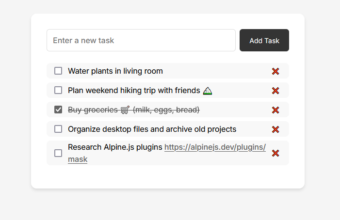

# Alpine.js To-Do List App

[](https://opensource.org/licenses/MIT)

A minimal to-do list application built with Alpine.js.



## Features

- 📝 Add new tasks with text input
- ✅ Toggle task completion status
- 💾 Local storage persistence
- URL display
- Multi-line Support
  - Press Shift+Enter for new lines
  - Start lines with `- ` for automatic bullets

## Installation

1. Clone the repository:
```bash
git clone https://github.com/chenxing-dev/todo-list.git
```

2. Navigate to project directory:
```bash
cd todo-list
```

3. Open `index.html` in your browser

## Usage

- **Add Task**: Type in the input field and click "Add Task" or press Enter
- **Complete Task**: Check the checkbox to toggle strikethrough
- **Delete Task**: Click the ❌ button next to any task
- **Persistent Storage**: All changes are automatically saved in browser's localStorage

## Technology Stack

- [Alpine.js](https://alpinejs.dev/) - Minimal framework for reactive JavaScript
- LocalStorage - Browser-based data persistence
- Vanilla CSS - Modern styling with flexbox

## Contributing

Contributions are welcome! Please follow these steps:
1. Fork the repository
2. Create your feature branch (`git checkout -b feature/your-feature`)
3. Commit your changes (`git commit -am 'Add some feature'`)
4. Push to the branch (`git push origin feature/your-feature`)
5. Open a Pull Request

## License

This project is licensed under the MIT License - see the [LICENSE](LICENSE) file for details.
